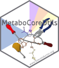
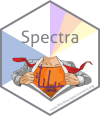

# Use Cases and Examples for Annotation of Untargeted Metabolomics Data

[](https://creativecommons.org/licenses/by-nc/4.0/)






This repository provides use cases and examples for the annotation of non-target
metabolomics or small compound MS data using the `MetaboAnnotation` and
`MetaboCoreUtils` R packages. Refer to the original article [A Modular and
Expandable Ecosystem for Metabolomics Data Annotation in
R](https://doi.org/10.3390/metabo12020173) to **cite** this package/repository
or any functionality described here.

## Installation

Requirements: R version >= 4.1 is needed. Some packages (`MetaboAnnotation` and
`CompoundDb`) are currently (January 2022) in the developmental branch of
Bioconductor and become officially part of the Bioconductor release 3.15 in
April 2022. Thus, these packages need to be installed from their github
repositories until they become part of the BioC 3.15 release.

The R packages as well as the example files used in this document can be
installed with the R code below:

```r
install.packages("BiocManager")
BiocManager::install("jorainer/MetaboAnnotationTutorials")
```


Alternatively, the packages can be installed individually with:

```r
install.packages("BiocManager")
BiocManager::install("RforMassSpectrometry/ProtGenerics")

## Packages with low-level core functionality
BiocManager::install("RforMassSpectrometry/MetaboCoreUtils")
BiocManager::install("RforMassSpectrometry/MsCoreUtils")

## Packages with high-level user functionality
BiocManager::install("RforMassSpectrometry/Spectra")
BiocManager::install("RforMassSpectrometry/MetaboAnnotation")
BiocManager::install("RforMassSpectrometry/CompoundDb")

## Support for MGF files
BiocManager::install("RforMassSpectrometry/MsBackendMgf")

## Support for MassBank
BiocManager::install("RforMassSpectrometry/MsBackendMassbank")

## Support for MSP files
BiocManager::install("RforMassSpectrometry/MsBackendMsp")
```

The source code for this document along with the test data can be downloaded
from the github repository https://github.com/jorainer/MetaboAnnotationTutorials
with the command (or alternatively downloading the zip archive directly from the
github page).

```
git clone https://github.com/jorainer/MetaboAnnotationTutorials
```


## Additional documentation resources and tutorials

- Tutorial with additional examples and explanations for MS2-based
  annotations: https://jorainer.github.io/SpectraTutorials/
- Repository of the `MsCoreUtils` package:
  https://rformassspectrometry.github.io/MsCoreUtils/
- Repository of the `MetaboCoreUtils` package:
  https://rformassspectrometry.github.io/MetaboCoreUtils/
- Repository of the `Spectra` package:
  https://rformassspectrometry.github.io/Spectra/
- Repository of the `MetaboAnnotation` package:
  https://rformassspectrometry.github.io/MetaboAnnotation/
- Repository of the `CompoundDb` package:
  https://rformassspectrometry.github.io/CompoundDb/
